# O Produto — CrediFab

O **CrediFab** é uma aplicação web de **governança financeira** para micro e
pequenas empresas (MPEs), com o propósito de organizar a vida financeira do
negócio e **prepará-lo para o acesso ao crédito**.

---

## Visão geral

O empreendedor cadastra sua empresa, registra **receitas e despesas**
organizadas por **categorias**, acompanha o **histórico** e o **dashboard**
financeiro e — nas etapas seguintes do roadmap — centraliza documentos, gera
relatórios e obtém um **diagnóstico e simulação de crédito**.

```mermaid
%%{init: {'theme':'base','themeVariables':{'fontFamily':'Lora, serif','fontSize':'15px','lineColor':'#7f8c8d','textColor':'#ffffff'},'flowchart':{'nodeSpacing':28,'rankSpacing':38,'padding':10,'useMaxWidth':false}}}%%
flowchart LR
    A([Cadastro / Login]) --> B([Empresa])
    B --> C([Categorias])
    C --> D([Transações])
    D --> E([Histórico / Dashboard])
    E --> F([Documentos])
    F --> G([Relatórios])
    G --> H([Diagnóstico e<br/>Simulação de Crédito])

    classDef step fill:#34495e,stroke:#1a252f,stroke-width:2px,color:#ffffff;
    classDef goal fill:#e74c3c,stroke:#c0392b,stroke-width:2px,color:#ffffff;
    class A,B,C,D,E,F,G step;
    class H goal;
```

---

## Documentos formais

| Documento                                  | Conteúdo                                             |
|--------------------------------------------|------------------------------------------------------|
| [Documento de Visão](visao.md)             | Problema, objetivos, requisitos, entidades e roadmap |
| [Documento de Arquitetura](arquitetura.md) | Stack, camadas, modelo de dados e endpoints          |

---
## Stack 

Front-end (React + Vite) conversando por **API REST/JSON** com
um back-end Flask que persiste em **PostgreSQL** via SQLAlchemy,
com autenticação **JWT**.

---