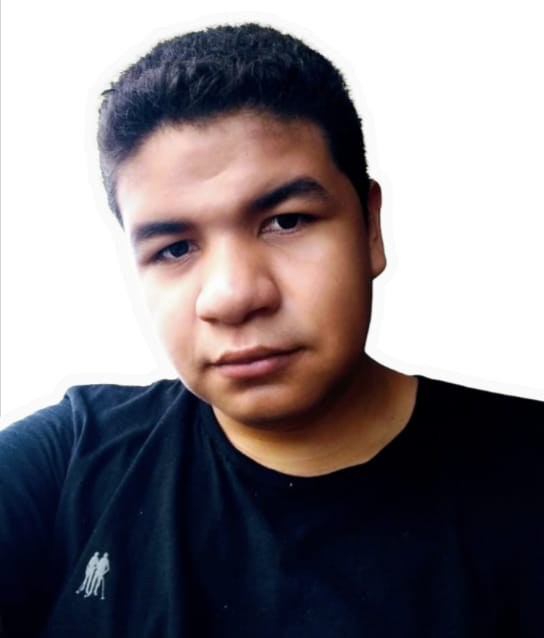
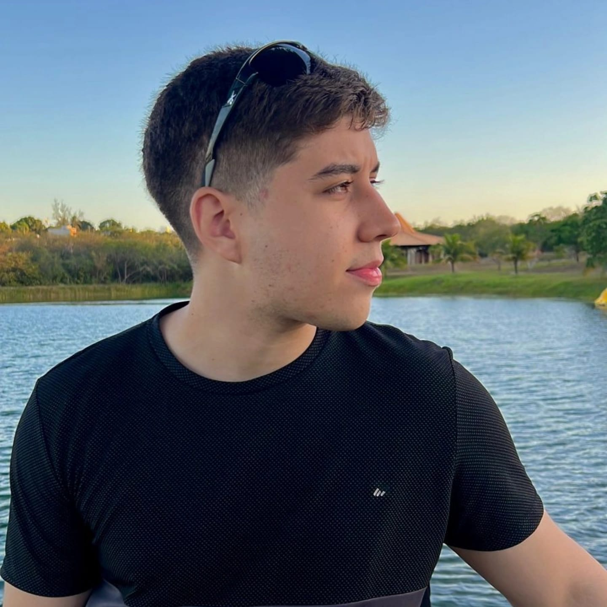
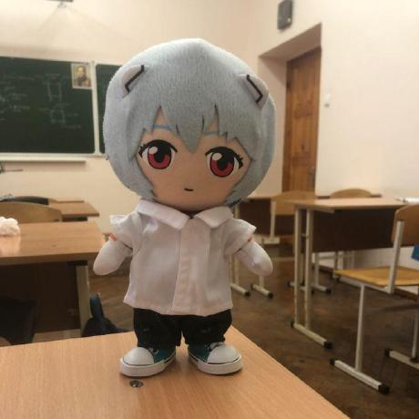
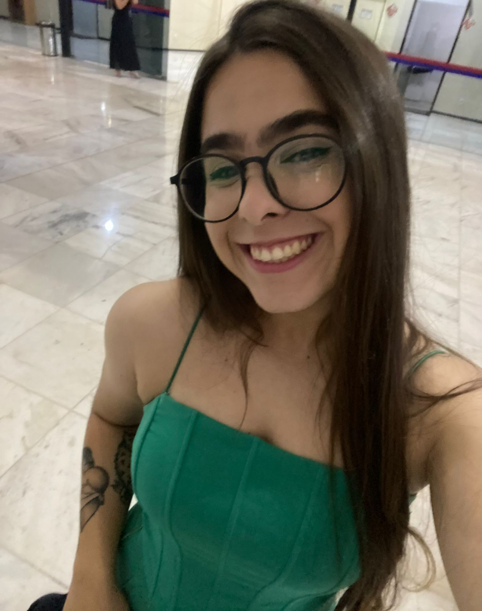
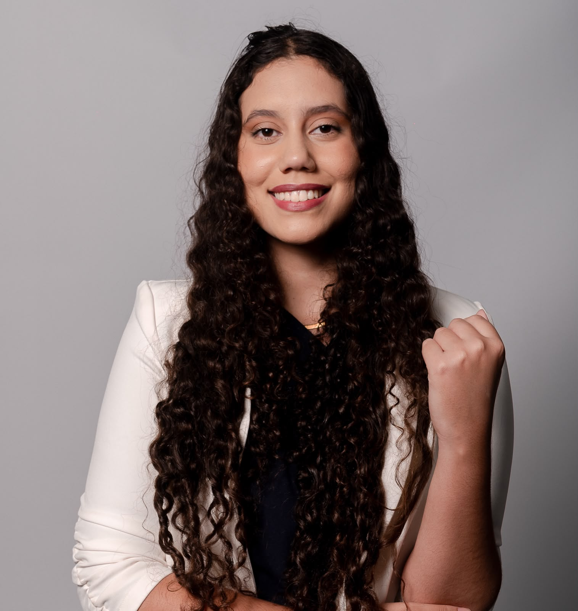
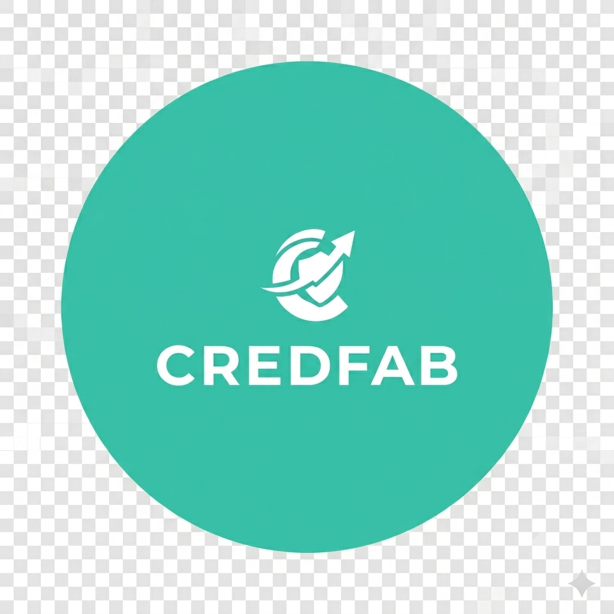
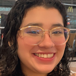
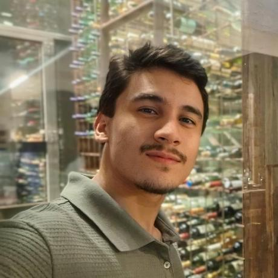

# Integrantes

O Grupo Parnas é composto por **12 integrantes**, organizados em duplas por
área de responsabilidade, seguindo o modelo de papéis da disciplina.

## Composição do time

| Nome                                 | Matrícula  | Papel                              |
|--------------------------------------|:----------:|------------------------------------|
| Alan Semil dos Santos Vieira         | 241025499  | Desenvolvimento (Back-end)         |
| Anna Júlia Aparecida Silva Primo     | 232024509  | Desenvolvimento (Front-end)        |
| Cibelle de Assis Silva               | 242015782  | Desenvolvimento (Front-end)        |
| Daniel Filipe Borges de Oliveira     | 251019771  | Analista de Qualidade e Testador   |
| **Eduardo Jesus Dal Pizzol**         | 251008114  | Analista de Banco de Dados / Líder |
| Gabriel Melo Rodrigues Cardone       | 251009185  | Desenvolvimento (Back-end)         |
| Igor Dantas Araújo                   | 251010186  | Desenvolvimento (Back-end)         |
| João Marcos Santos e Carvalho        | 242028708  | Desenvolvimento (Front-end)        |
| João Pedro da Nóbrega Souza Cordeiro | 251023184  | Desenvolvimento (Back-end)         |
| Júlia Amanda Silva Lima              | 242015871  | Desenvolvimento (Front-end)        |
| Maria Eduarda de Oliveira Gomes      | 242028842  | Analista de Banco de Dados         |
| Matheus Moretti Soares               | 251013660  | Analista de Qualidade e Testador   |

## Orientação

| Nome                       | Papel                                     |
|----------------------------|-------------------------------------------|
| Ricardo Ajax Dias Kosloski | Docente da disciplina (MDS — T01, 2026.1) |

## Dupla de Qualidade

A garantia de qualidade do produto fica a cargo da dupla **Daniel Filipe** e
**Matheus Moretti**, responsável por:

- definir a estratégia de testes do projeto;
- elaborar planos e casos de teste;
- escrever e executar as **suítes automatizadas** (Pytest, Vitest e Playwright);
- revisar os artefatos produzidos pelo time;
- consolidar a documentação de testes e a **análise GQM** a cada Sprint.

## Documentação

**Daniel Filipe** é também responsável pela elaboração das **atas de reunião** (mantidas no
Overleaf e publicadas neste site) e pela manutenção e organização de todos os documentação produzidos que sejam
referentes ao Grupo Parnas.

---

## Equipe em fotos

> As fotos ficam em `docs/assets/images/integrantes/`. Hoje estão com imagens
> temporárias; basta substituir cada arquivo pelo retrato real, mantendo o mesmo nome
> (ex.: `alan-semil.png`). Cada foto leva ao GitHub pessoal do integrante.

### Desenvolvimento - Back-end

<figure class="team-card" markdown>

<figcaption markdown>
**[Alan Semil](https://github.com/Semil-2006)** 
<small>Dev Back-end</small>
</figcaption>
</figure>
<figure class="team-card" markdown>

<figcaption markdown>
**[Gabriel Cardone](https://github.com/gabriellcardone-06)** 
<small>Dev Back-end</small>
</figcaption>
</figure>
<figure class="team-card" markdown>

<figcaption markdown>
**[Igor Dantas](https://github.com/IgorDARAUJO)** 
<small>Dev Back-end</small>
</figcaption>
</figure>
<figure class="team-card" markdown>

<figcaption markdown>
**[João da Nóbrega](https://github.com/nbg-cordeiro)** 
<small>Dev Back-end</small>
</figcaption>
</figure>

### Desenvolvimento - Front-end

<figure class="team-card" markdown>

<figcaption markdown>
**[Anna Júlia](https://github.com/annaaju)** 
<small>Dev Front-end</small>
</figcaption>
</figure>
<figure class="team-card" markdown>

<figcaption markdown>
**[Cibelle de Assis](https://github.com/cibelledeas-boop)** 
<small>Dev Front-end</small>
</figcaption>
</figure>
<figure class="team-card" markdown>

<figcaption markdown>
**[João Marcos](https://github.com/dev-joaocarvalho)** 
<small>Dev Front-end</small>
</figcaption>
</figure>
<figure class="team-card" markdown>

<figcaption markdown>
**[Júlia Amanda](https://github.com/juliaamandasl)** 
<small>Dev Front-end</small>
</figcaption>
</figure>

### Qualidade e Testes (QA)

<figure class="team-card" markdown>

<figcaption markdown>
**[Daniel Filipe](https://github.com/daniel-fbo)** 
<small>QA / Tests</small>
</figcaption>
</figure>
<figure class="team-card" markdown>

<figcaption markdown>
**[Matheus Moretti](https://github.com/Boynic3)** 
<small>QA / Tests</small>
</figcaption>
</figure>

### Banco de Dados

<figure class="team-card" markdown>

<figcaption markdown>
**[Eduardo Pizzol](https://github.com/Edupizzol)** 
<small>DBA / Líder</small>
</figcaption>
</figure>
<figure class="team-card" markdown>

<figcaption markdown>
**[Maria Eduarda](https://github.com/eduarda-ogomes)** 
<small>DBA</small>
</figcaption>
</figure>

---